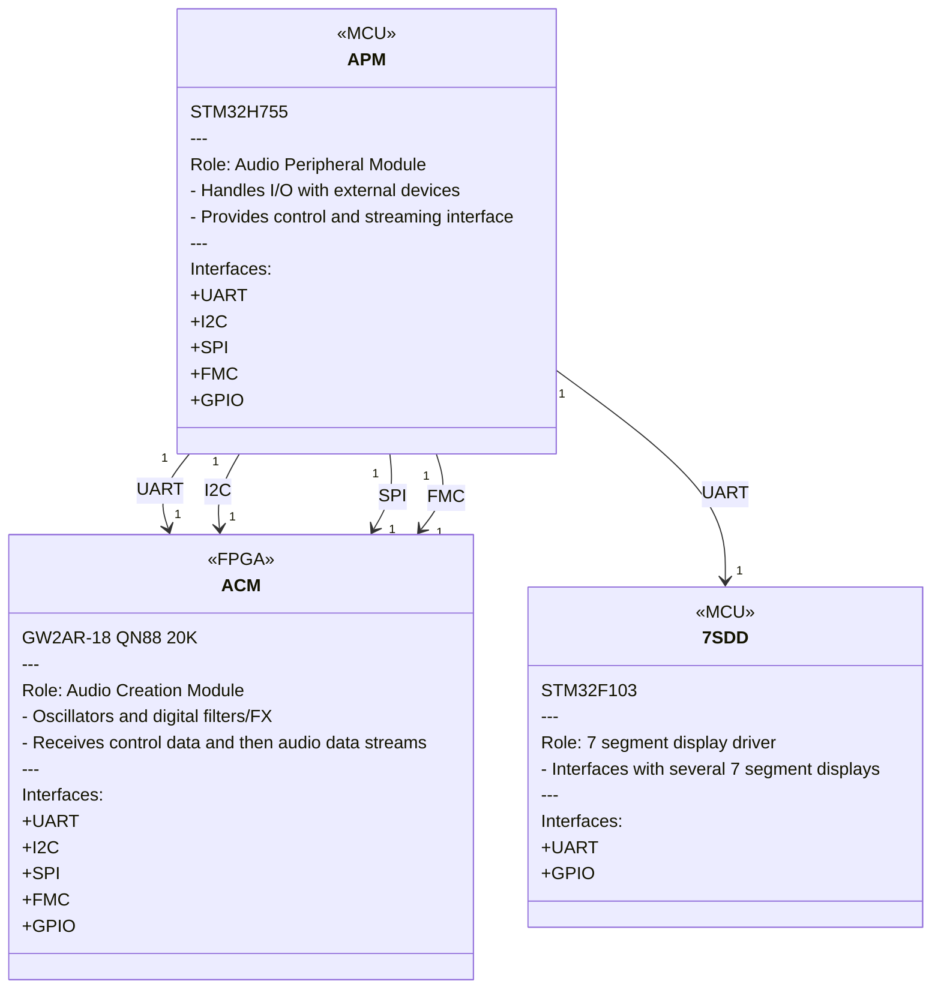

```mermaid
classDiagram
    class APM {
        <<MCU>>
        STM32H755
        ---
        Role: Audio Peripheral Module
        - Handles I/O with external devices
        - Provides control and streaming interface
        ---
        Interfaces:
        +UART
        +I2C
        +SPI
        +FMC
        +GPIO
    }

    class 7SDD {
        <<MCU>>
        STM32F103
        ---
        Role: 7 segment display driver
        - Interfaces with several 7 segment displays
        ---
        Interfaces:
        +UART
        +GPIO
    }

    class ACM {
        <<FPGA>>
        GW2AR-18 QN88 20K
        ---
        Role: Audio Creation Module
        - Oscillators and digital filters/FX
        - Receives control data and then audio data streams
        ---
        Interfaces:
        +UART
        +I2C
        +SPI
        +FMC
        +GPIO
    }

    %% Associations
    APM "1" --> "1" ACM : UART
    APM "1" --> "1" ACM : I2C
    APM "1" --> "1" ACM : SPI
    APM "1" --> "1" ACM : FMC
    
    APM "1" --> "1" 7SDD : UART
```
